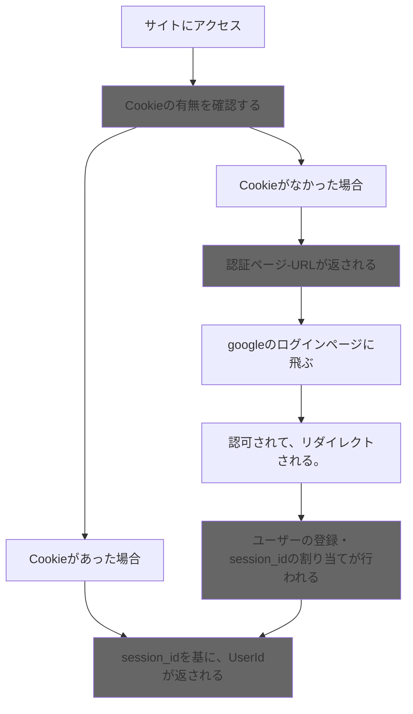
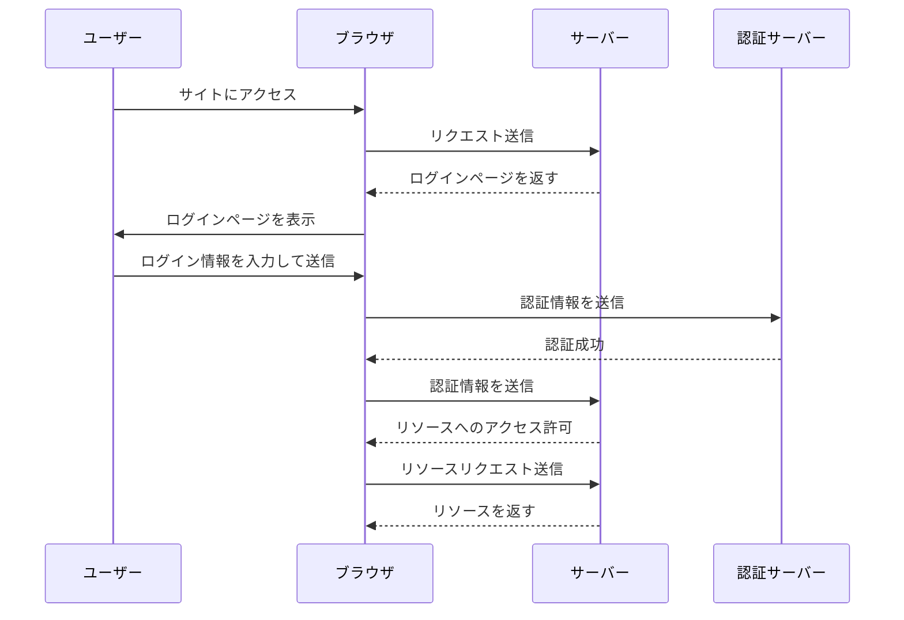

ログイン周りの処理のイメージ
薄灰色になっているところが認証周りで必要そうなアプリケーションのイメージ。

```mermaid
graph TD;
    classDef col fill:#666666

A[サイトにアクセス] --> B[Cookieの有無を確認する]:::col
B --> C[Cookieがあった場合]
C --> E[session_idを基に、UserIdが返される]
B --> D[Cookieがなかった場合]
D --> DA[認証ページ-URLが返される]:::col
DA --> DB[googleのログインページに飛ぶ]
DB --> DC[認可されて、リダイレクトされる。]
DC --> DD[ユーザーの登録・session_idの割り当てが行われる]:::col
DD --> E:::col
```

---

```mermaid
sequenceDiagram
    participant User as ユーザー
    participant Browser as ブラウザ
    participant Server as サーバー
    participant Auth as 認証サーバー

    User ->> Browser: サイトにアクセス
    Browser ->> Server: リクエスト送信
    Server -->> Browser: ログインページを返す
    Browser ->> User: ログインページを表示
    User ->> Browser: ログイン情報を入力して送信
    Browser ->> Auth: 認証情報を送信
    Auth -->> Browser: 認証成功
    Browser ->> Server: 認証情報を送信
    Server -->> Browser: リソースへのアクセス許可
    Browser ->> Server: リソースリクエスト送信
    Server -->> Browser: リソースを返す

```

---