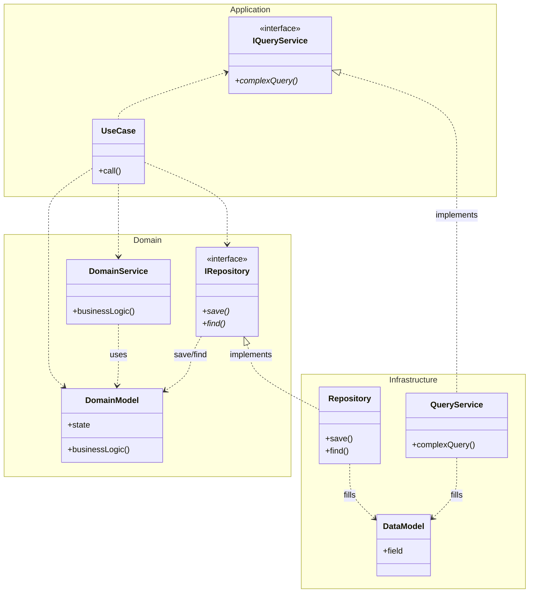

### ディレクトリ構成
```
.
├── application # domain/service を呼び出して, use case を実現する
├── domain      # ビジネスロジックを記述する
│   ├── model   # ドメインの概念の抽象オブジェクト (ドメインモデル)
│   └── service # 特定のドメインオブジェクトに属さないビジネスロジック
└── infrastructure  # 技術詳細に関するコード
    └── db
        ├── model           # データベースのテーブルに対応するオブジェクト
        ├── repository      # 永続化の実装
        └── query_service   # 複雑な読み取りクエリの実装
```

### 依存関係
- Domain は他のモジュールに依存しません (外に向かう矢印がない). すなわち, 最も安定なモジュールです.
- Application は Domain に依存します. Infrastructure には依存しません
- Infrastructure は Application, Domain に依存します. すなわち, 最も不安定なモジュールです.


### 参考
- [ADOP (Application Domain Others Pattern)](https://nrslib.com/adop/)